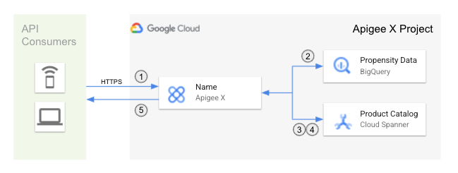

# WIP - TESTING - PRIVATE USE ONLY

# Smart API to Predict Customer Propensity to buy using Apigee, BigQuery ML and Cloud Spanner
## Overview 

This demo shows how to bild a smart API that predicts customer propensity to buy using an Apigee X proxy, BigQuery ML and Cloud Spanner.
Cloud Spanner holds a small Product Catalog with rich content, such as descriptions and image references. 
BigQuery contains a sample dataset for the complete Product Catalog and a number of simulated users. 
It uses Machine Learning to predict their propensity to buy based on the time the user spends on an item, termed the "predicted session duration confidence".
Apigee exposes an API that proxies to BigQuery to get the product IDs and the "predicted session duration confidence" for a particular user and then makes a callout to Spanner to get the rich product content.
The proxy then combines that to create the priority sorted result that is sent in the response.

### Architecture Diagram



## Prerequisites 

This demo relies on the use of a GCP Project for [Apigee X](), [Big Query]() and [Cloud Spanner](). 

**NOTE:** If you don't already have Apigee X setup in you can [provision an evaluation organization](https://cloud.google.com/apigee/docs/api-platform/get-started/provisioning-intro), that will require a billing account.

It uses [gcloud](https://cloud.google.com/sdk/gcloud) and [Maven](https://maven.apache.org/), both can be run from the GCloud shell without any installation.

The API proxy uses a separate Service Account (datareader) for GCP authentication to access Big Query and Spanner.
We'll get and use a GCP accesss token to deploy the proxy.


The high level steps are:
1. First [set environment variables and enable APIs](#set-environment-variables-and-enable-apis).
2. Using an existing GCP Project or after creating a GCP Project, [ceate Service Account for proxy deployment](#create-datareader-service-account).
3. Use a sample dataset to [train BigQuery to predict customer propensity](#train-bigquery-to-predict-customer-propensity).
4. Install a Product Catalog using [Setup Spanner Product Catalog](#setup-spanner-product-catalog).
5. Install Apigee X proxy using [Maven](#setup-apigee-x-proxy)

## Setup

### Set Environment Variables and Enable APIs
First set your environment variables:
```
export PROJECT_ID=apigeex-mint-kurt
export ORG=$PROJECT_ID
export ENV=dev-1
export ENVGROUP_HOSTNAME=xapi-test.kurtkanaskie.net
export SPANNER_INSTANCE=product-catalog
export SPANNER_DATABASE=product-catalog-v1
export REGION=regional-us-east1
```

### Create datareader Service Account
```
gcloud iam service-accounts create datareader --display-name="Data reader for BQ and Spanner Demo"
gcloud iam service-accounts list | grep datareader 

export SA=$(gcloud iam service-accounts list | grep datareader | cut -d" " -f12)
# e.g. datareader@apigeex-mint-kurt.iam.gserviceaccount.com
echo $SA

gcloud projects add-iam-policy-binding $PROJECT_ID --member="serviceAccount:$SA" --role="roles/spanner.databaseUser" --quiet
gcloud projects add-iam-policy-binding $PROJECT_ID --member="serviceAccount:$SA" --role="roles/spanner.databaseReader" --quiet
gcloud projects add-iam-policy-binding $PROJECT_ID --member="serviceAccount:$SA" --role="roles/bigquery.dataViewer" --quiet
gcloud projects add-iam-policy-binding $PROJECT_ID --member="serviceAccount:$SA" --role="roles/bigquery.user" --quiet
```

### Train BigQuery to Predict Customer Propensity

Follow the Machine Learning tutorial [Predicting customer propensity to buy by using BigQuery ML and AI Platform](https://cloud.google.com/architecture/predicting-customer-propensity-to-buy). Then return here to setup Spanner and Apigee.

### Setup Spanner Product Catalog

Set up Spanner Product Catalog (5 items) by running the [setup_spanner.sh](#setup_spanner.sh) shell script.

Return here to setup Apigee.


### Setup Apigee X Proxy

The Apigee proxy will be deployed using Maven. 
The Maven command will create and deploy a proxy (product-recommendations-v1), create an API Product (product-recommendations-v1-$ENV), create an App Developer (demo@any.com) and App (product-recommendations-v1-app-$ENV).

In the project open the cloud shell.
```
git clone git@github.com:kurtkanaskie/product-recommendations-v1.git
```

Modify the pom.xml file's profile to use your `apigee.profile`, `apigee.org`, `apigee.env`, `api.northbound.domain`, `gcp.projectid`, and `googletoken.email`.
```
<profile>
    <id>YOUR_PROFILE_NAME</id>
    <properties>
        <apigee.profile>YOUR_PROFILE_NAME</apigee.profile> <!-- Typically a combination of ORG-ENV -->
        <apigee.org>YOUR_ORG_NAME</apigee.org>
        <apigee.env>YOUR_ENV_NAME</apigee.env>
        <api.northbound.domain>YOUR_ENVGROUP_HOSTNAME</api.northbound.domain>
        <gcp.projectid>YOUR_PROJECT_ID</gcp.projectid> <!-- Same as org but could be a remote project for BQ and Spanner -->
        <apigee.googletoken.email>${googleTokenEmail}</apigee.googletoken.email> <!-- SA Email for GCP Authentication in Proxy -->
        
        <apigee.apiversion>v1</apigee.apiversion>
        <apigee.hosturl>https://apigee.googleapis.com</apigee.hosturl>
        <apigee.config.file>target/edge.json</apigee.config.file>
        <apigee.config.exportDir>target/test/integration</apigee.config.exportDir>
        <apigee.config.options>update</apigee.config.options>
        <apigee.authtype>oauth</apigee.authtype>
        <apigee.bearer>${bearer}</apigee.bearer>
        <apigee.options>override</apigee.options>
    </properties>
</profile>
```

Run Maven to install the proxy and it's associated artifacts and then test the API, all in one command.
```
mvn -P $ORG-$ENV clean install -Dbearer=$(gcloud auth print-access-token) -DgoogleTokenEmail=$SA
```
The result of the integration test shows 2 API calls, one to `/openapi` and another to `/products`.
It also displays the App credentials which can be used for susequent API calls. 
For example:
```
curl https://xapi-test.kurtkanaskie.net/v1/recommendations/products -H x-apikey:4W6K0HwG8SezrTZN2mZvaZSEGkWzH0b8zc3PALb49xEA9XcK
```
You can also get the API Key for the App using the Apigee API:
```
curl -s -H "Authorization: Bearer $(gcloud auth print-access-token)" \
    https://apigee.googleapis.com/v1/organizations/$ORG/developers/demo@any.com/apps/product-recommendations-v1-app-$ENV | jq .credentials[0].consumerKey
```

## Cleanup

### Cleanup Apigee

Run Maven to undeploy and delete proxy and it's associated artifacts, all in one command.
```
mvn -P $ENV -Dbearer=$(gcloud auth print-access-token) -Dskip.integration=true \
    apigee-config:apps apigee-config:apiproducts apigee-config:developers -Dapigee.config.options=delete \
    apigee-enterprise:deploy -Dapigee.options=clean
```

### Cleanup Spanner
Remove the Spanner resources by running the [cleanup_spanner.sh](#cleanup_spanner.sh) shell script.

### Cleanup BigQuery
Cleanup BigQuery using the [Cleanup components](https://cloud.google.com/architecture/predicting-customer-propensity-to-buy#delete_the_components) from the tutorial rather than deleting the project as you may want to continue to use Apigee X.

### Delete Service Account
```
export SA=$(gcloud iam service-accounts list | grep datareader | cut -d" " -f12)
gcloud iam service-accounts delete $SA
```


